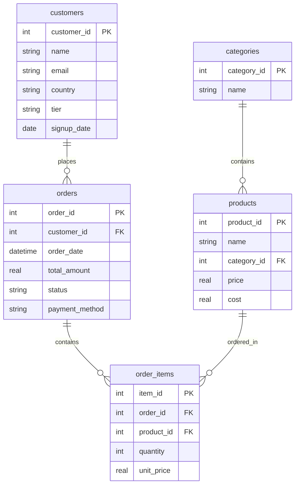

# 🏗️ Architecture & Database Reference

This document provides a technical overview of the application structure, SQLite database schema, mock data generators, and active API endpoints.

---

## 🗄️ Database Schema & Data Models

The database is built on **SQLite** and resides at `backend/data/ecommerce.db`. It consists of 5 relational tables designed to mimic a SaaS & E-Commerce platform.

### Database Schema Diagram (Logical)



### Table Details
1. **`categories`**: Product categories (e.g. Enterprise Software, AI Microservices).
2. **`products`**: Catalog items containing pricing and unit cost details for profit margin calculations.
3. **`customers`**: User accounts including locations, subscription tiers (Free, Starter, Professional, Enterprise), and signup history.
4. **`orders`**: Transaction records tracking payment methods, dates, status (Completed, Processing, Refunded), and total transactional value.
5. **`order_items`**: Line item splits for each transaction specifying product identifiers, purchased quantities, and historic unit prices.

---

## ⚙️ Backend Architecture

The backend is built as a modular **FastAPI** service:
- **`app/main.py`**: Boots the FastAPI app, manages application lifecycle events, configures CORS settings, and mounts routers.
- **`app/core/`**:
  - `config.py`: Configuration manager using `pydantic-settings` to auto-parse environment values from the `.env` file.
  - `logging.py`: A unified logger formatting stdout trace streams.
- **`app/api/v1/`**:
  - `router.py`: Centralized endpoint router aggregator.
  - `endpoints/health.py`: System health check status.
  - `endpoints/datasources.py`: Scans the SQLite system dynamically, counts rows, and returns database connector metadata.
  - `endpoints/analytics.py`: Contains a Text-to-SQL mockup dispatcher. In development mode, it supports exact parsing of keywords (e.g. "revenue", "customer", "order") to run real queries on SQLite and return actual dataset records to the API client.

---

## ⚡ Future Steps: Connecting Frontend to Backend

Currently, the React frontend displays high-fidelity mock designs. To wire up the user interface with the FastAPI endpoints, follow this integration approach:

### 1. Configure a Proxy or Base URL
Define an API base URL utility or setup a Vite proxy in `frontend/vite.config.ts` to route `/api` requests to `http://localhost:8000`.

### 2. Update `AnalyticsPage` to Fetch Results
Instead of displaying hardcoded `sampleSQL` and `sampleData`, invoke the `/api/v1/analytics/query` endpoint inside a React `useEffect` or button event handler:

```typescript
const handleQuerySubmit = async (userPrompt: string) => {
  try {
    const response = await fetch("http://localhost:8000/api/v1/analytics/query", {
      method: "POST",
      headers: {
        "Content-Type": "application/json",
      },
      body: JSON.stringify({ prompt: userPrompt }),
    });
    const result = await response.json();
    
    // Set the query outputs in your component state
    setGeneratedSQL(result.generated_sql);
    setColumns(result.columns);
    setData(result.data);
    setExecutionTime(result.execution_time_ms);
  } catch (error) {
    console.error("Failed to execute analytical query:", error);
  }
};
```

### 3. Fetch Real Connectors in `DataSourcesPage`
Call `GET /api/v1/datasources` to retrieve active databases and CSV files dynamically, rendering rows and sync badges based on database counts.
